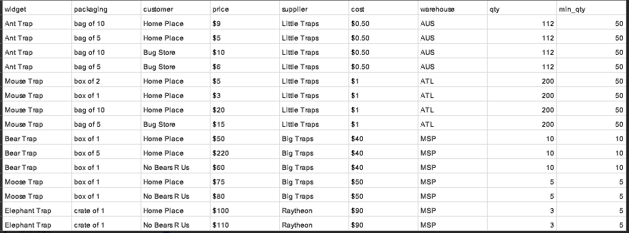

## 
### The problem
Create a basic system description and document a normalized schema
from the attached widgets (widgets.tsv) text file. 
Include 
1) what you think this system would do
2) what you feel would be a reasonable database structure for the data and a reasonable
architecture for the system 
3) any questions or concerns you have regarding this
dataset/system that might need to be answered before establishing an ideal database/solution
for such a system. It's a very open-ended problem.

### The solution
The structure of the data is very dependent of the problem/system/functionality it is being used.
This might look just fine if it serves the functionality in this structure.

1. Looks like a wholesale/reseller information.
Normally I have to ask the questions first but I will make the assumption that this original table represents items that are being sold (are part of a sale).
With this in mind the table inputs are SALES transactions where a widget (from a warehouse), is being sold, with a certain packing, to a customer 
at a price, in a quantity.

With this I see the following entities:

WAREHOUSES
CUSTOMERS
SUPPLIERS

WIDGETS - this is the store inventory with goods/widgets that come from suppliers, at a cost, and are kept in warehouses
SALES - this is the transactions sales table, where widgets (referred by widget_id) are being sold in a quantity at a price

2. With above assumptions I see the following entities in this data:

    - SALES table        
       - id (primary, key)
       - customer_id (foreign key)
       - widget_id (foreign key)
       - packing
       - price
       - qty
       - min_qty
       - TBD
    
    - WIDGETS table        
       - id (primary, key)
       - supplier_id (foreign key)
       - warehouse_id (foreign key)
       - widget
       - cost
       
    - CUSTOMERS table
        - id (primary, key)
        - customer
        - TBD
      
    - SUPPLIERS table
       - id (primary, key)
       - supplier
       - TBD
        
    - WAREHOUSES table
       - id (primary, key)
       - warehouse
       - TBD

3. First I have to understand the system and the functionality. as I've assumed something that I must validate.
- what is `min_qty` (as I see this could be greater ot lower that the `qty` field)
- It feels like there is more data and the original table is a join query afterall. 
So what more data is there for these entities?
- Is `cost` the value/attribute payed to supplier and `price` the value payed by the customer? (as I've assumed) 